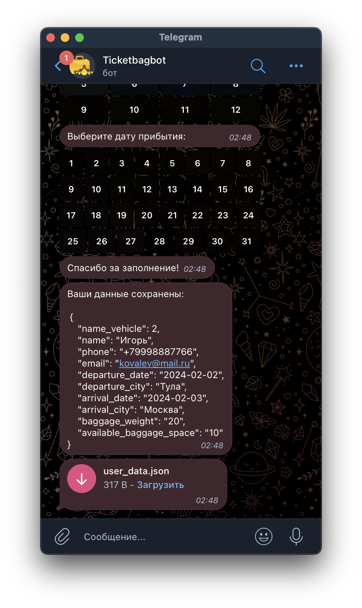

# Ticketbag_bot
## @Ticketbag_bot - Бот опрашивает пользователя и отправляет данные в формате JSON владельцу

Бот разработан с помощью библиотеки Aiogram 3

## Основной функционал и команды

1. /start - Запуск бота. 
2. /add_route - Добавить маршрут.
3. Приветствует нового пользователя в чате группы.
4. Отправляет данные пользователя в формате JSON владельцу бота.

### Подключение
1. Клонируйте репозиторий и перейдите в него в командной строке: https://github.com/IgorYKovalev/Ticketbag_bot.git
2. Установите виртуальное окружение: `python -m venv <название>`
3. Активируйте виртуальное окружение: `source venv/Scripts/activate`
4. Установите зависимости: `pip install -r requirements.txt`
5. Создайте файл .env и добавьте в него свой: TOKEN

### Запуск
Находясь в папке проекта, запустите файл в терминале main.py
`python3 main.py`